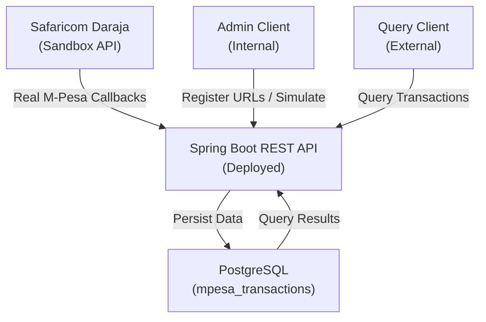

# M-Pesa C2B REST API

A  **Customer-to-Business (C2B) REST API** for M-Pesa payments, fully integrated with **Safaricom Daraja sandbox**. M-Pesa transaction callback handling

## Project Overview

This REST API enables businesses to:
- **Receive real M-Pesa C2B payment callbacks** from Daraja sandbox
- **Persist transactions** to PostgreSQL database
- **Query transaction history** by phone number, shortcode, or transaction ID
- **Monitor payment flows** with comprehensive logging and error handling

## API Documentation

**Interactive API Documentation:** [Postman Collection](https://www.postman.com/one-k-professionals/api-studio/example/32756309-c6f78be9-a607-4277-b787-a197a2c51207)

All endpoints are documented and ready to test in Postman. Update the `base_url` variable with your deployment domain.


## Architecture



## Test Suite

**Total Tests: 24** | **Pass Rate: 100%**

| Test Class | Tests | Status |
|-----------|-------|--------|
| MpesaAdminControllerIntegrationTest | 5 | Pass |
| MpesaC2bControllerIntegrationTest | 6 |  Pass |
| MpesaC2bApiApplicationTests | 1 |  Pass |
| MpesaAuthServiceSimpleTest | 2 |  Pass |
| MpesaTransactionServiceTest | 10 |  Pass |

**Run tests:**
```bash
.\mvnw.cmd test
```

## Getting Started

### Prerequisites
- Java 17+
- Maven 3.8+
- PostgreSQL 16+
- A publicly accessible domain/server for Daraja callbacks

### 1. Database Setup

This project uses **PostgreSQL 16** with migrations managed through a separate database service repository.

**Database migrations and setup are handled by:**
[GIL Database Service](https://github.com/victorpreston/GIL-database-service)

**To set up the database:**

1. Clone the database service repository:
```bash
git clone https://github.com/victorpreston/GIL-database-service.git
cd GIL-database-service
```

2. Install dependencies:
```bash
npm install
```

3. Run migrations:
```bash
npx knex migrate:latest
```

4. To rollback migrations:
```bash
npx knex migrate:rollback
```

The `mpesa_db` database will be created with all required tables and schemas for the M-Pesa C2B API.

### 2. Configuration
```properties
# Database
spring.datasource.url=jdbc:postgresql://localhost:5432/mpesa_db
spring.datasource.username=postgres
spring.datasource.password=your_password

# Daraja Credentials 
mpesa.consumer.key=YOUR_CONSUMER_KEY
mpesa.consumer.secret=YOUR_CONSUMER_SECRET
mpesa.shortcode=600984

# Callback URL
mpesa.confirmation.url=https://your-api-domain-url/api/v1/callback
```

### 3. Run Application
```bash
# Build
.\mvnw.cmd clean package -DskipTests

# Run
.\mvnw.cmd spring-boot:run

# API available at: http://localhost:8080
```

### 4. Deploy and Configure

Deploy the application to your chosen platform and update `your-api-domain-url` in the configuration with your actual domain. The Daraja sandbox will send callbacks to this publicly accessible URL.

## API Endpoints

### Callback Endpoint (Daraja sends transactions here)
```
POST /api/v1/callback
POST /api/v1/mpesa/c2b/callback
```
**Example Daraja callback payload:**
```json
{
  "TransID": "UB5030BU3T",
  "TransAmount": "250.00",
  "TransactionType": "Pay Bill",
  "BusinessShortCode": "600984",
  "BillRefNumber": "INVOICE001",
  "MSISDN": "254708374149",
  "TransTime": "20260205085200",
  "FirstName": "John",
  "OrgAccountBalance": "19091571.50"
}
```

**Response:**
```json
{
  "message": "Transaction captured successfully",
  "resultCode": "0",
  "resultDescription": "Success",
  "transactionId": "6cfa36cd-806d-465b-8bd4-87fb32e664be",
  "timestamp": 1770270843022
}
```

### Query Endpoints

**Get all transactions:**
```
GET /api/v1/mpesa/c2b/all
```

**Get by transaction ID:**
```
GET /api/v1/mpesa/c2b/transaction/{transactionId}
```

**Get by phone number:**
```
GET /api/v1/mpesa/c2b/msisdn/{msisdn}
```

**Get by business shortcode:**
```
GET /api/v1/mpesa/c2b/shortcode/{shortcode}
```

**Health check:**
```
GET /api/v1/mpesa/c2b/health
```

### Admin Endpoints

**Register callback URLs with Daraja:**
```
POST /api/v1/mpesa/admin/register-urls
Content-Type: application/json

{
  "shortCode": "600984",
  "confirmationUrl": "https://your-api-domain-url/api/v1/callback",
  "validationUrl": "https://your-api-domain-url/api/v1/callback"
}
```

**Simulate C2B transaction from Daraja:**
```
POST /api/v1/mpesa/admin/simulate
Content-Type: application/json

{
  "shortCode": "600984",
  "commandID": "CustomerPayBillOnline",
  "amount": "250",
  "msisdn": "254708374149",
  "billRefNumber": "INVOICE001"
}
```

These admin endpoints enable testing of the callback registration and transaction simulation flows directly from your API.


### Step 3: Verify Callback
Check application logs:
```
[INFO] Received C2B callback
[INFO] Processing C2B callback for transaction: UB5030BU3T
[INFO] Transaction saved successfully with ID: 6cfa36cd-806d-465b-8bd4-87fb32e664be
[INFO] Callback processed successfully
```

Query database:
```
GET http://localhost:8080/api/v1/mpesa/c2b/all
```

## Key Technologies

| Component | Technology | Version |
|-----------|-----------|---------|
| **Framework** | Spring Boot | 4.0.2 |
| **ORM** | Hibernate JPA | 7.2.1 |
| **Database** | PostgreSQL | 16.3 |
| **Testing** | JUnit 5 | Jupiter |
| **Build** | Maven | 3.8+ |
| **Java** | Java SE | 17+ |
| **HTTP Client** | RestTemplate | Spring |