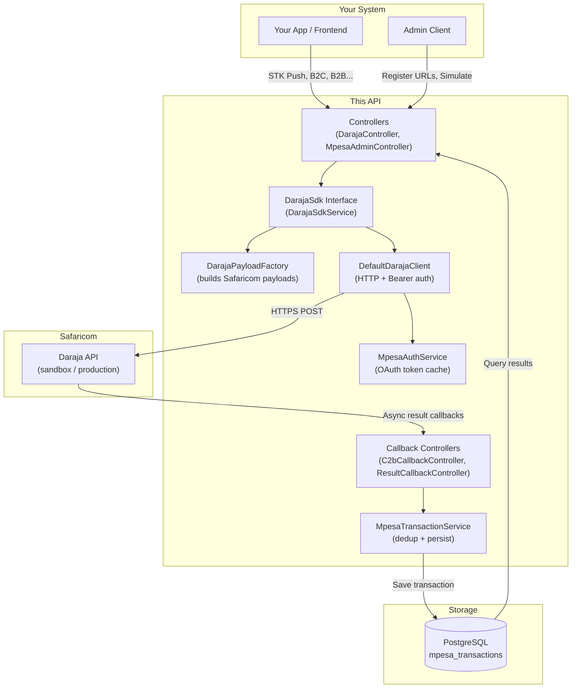
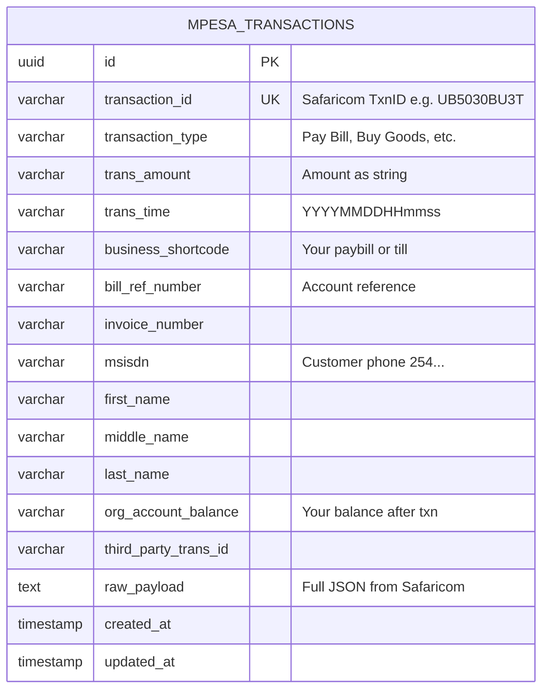

# M-Pesa Daraja API

A production-ready **Spring Boot REST API** that integrates with all **Safaricom Daraja APIs** — STK Push, C2B, B2C, B2B, Transaction Status, Account Balance, Reversals, Dynamic QR, and Bill Manager. Built with clean architecture, full test coverage, and Docker support.

[](https://openjdk.org/projects/jdk/21/)
[](https://spring.io/projects/spring-boot)
[](https://www.postgresql.org/)
[]()
[]()

---

## What This Is

This API acts as a **middleware layer** between your business system and Safaricom. You call this API; it authenticates, builds the correct payload, and forwards the request to Daraja. Safaricom sends async results back to your configured callback URLs, which this API receives, validates, and persists.

---

## Architecture



---

## Database Schema



---

## API Endpoints

### Outbound — you call these

| Method | Endpoint | Description |
|--------|----------|-------------|
| `POST` | `/api/v1/mpesa/stk-push` | Trigger payment prompt on customer phone |
| `POST` | `/api/v1/mpesa/stk-push/query` | Check STK push status |
| `POST` | `/api/v1/mpesa/b2c/payment` | Send money to customer |
| `POST` | `/api/v1/mpesa/b2b/payment` | Pay another business |
| `POST` | `/api/v1/mpesa/transactions/status` | Query transaction status |
| `POST` | `/api/v1/mpesa/account-balance` | Check business account balance |
| `POST` | `/api/v1/mpesa/reversal` | Reverse a transaction |
| `POST` | `/api/v1/mpesa/dynamic-qr` | Generate payment QR code |
| `POST` | `/api/v1/mpesa/bill-manager/invoices/single` | Create single invoice |
| `POST` | `/api/v1/mpesa/bill-manager/invoices/bulk` | Create bulk invoices |
| `POST` | `/api/v1/mpesa/bill-manager/invoices/cancel` | Cancel invoice |
| `POST` | `/api/v1/mpesa/bill-manager/reconciliation` | Reconcile billing |

### Admin

| Method | Endpoint | Description |
|--------|----------|-------------|
| `POST` | `/api/v1/mpesa/admin/register-urls` | Register confirmation/validation URLs with Daraja |
| `POST` | `/api/v1/mpesa/admin/simulate` | Simulate a C2B payment (sandbox only) |

### Inbound — Safaricom calls these

| Method | Endpoint | Description |
|--------|----------|-------------|
| `POST` | `/api/v1/mpesa/c2b/confirmation` | C2B payment confirmation |
| `POST` | `/api/v1/mpesa/c2b/validation` | C2B payment validation |
| `POST` | `/api/v1/mpesa/results/stk` | STK Push async result |
| `POST` | `/api/v1/mpesa/results` | B2C / B2B / Reversal / Status / Balance result |
| `POST` | `/api/v1/mpesa/results/timeout` | Queue timeout notification |

### Transaction Queries

| Method | Endpoint | Description |
|--------|----------|-------------|
| `GET` | `/api/v1/mpesa/c2b/all` | All transactions |
| `GET` | `/api/v1/mpesa/c2b/transaction/{transactionId}` | By Safaricom transaction ID |
| `GET` | `/api/v1/mpesa/c2b/msisdn/{msisdn}` | By customer phone number |
| `GET` | `/api/v1/mpesa/c2b/shortcode/{shortcode}` | By business shortcode |
| `GET` | `/api/v1/mpesa/c2b/health` | Health check |

---

## Getting Started

### Prerequisites

- Java 21+
- Docker & Docker Compose (recommended), or PostgreSQL 16+ manually
- A Safaricom Daraja account — [register here](https://developer.safaricom.co.ke/)
- A publicly accessible HTTPS URL for Daraja callbacks (use [ngrok](https://ngrok.com/) for local dev)

### 1. Clone

```bash
git clone https://github.com/victorpreston/mpesa-api.git
cd mpesa-api
```

### 2. Configure

Create `src/main/resources/application-dev.properties`:

```properties
# Database
spring.datasource.url=jdbc:postgresql://localhost:5432/mpesa_db
spring.datasource.username=postgres
spring.datasource.password=your_password
spring.jpa.hibernate.ddl-auto=update

# Daraja credentials (from developer.safaricom.co.ke)
mpesa.consumer-key=YOUR_CONSUMER_KEY
mpesa.consumer-secret=YOUR_CONSUMER_SECRET

# Your business shortcode
mpesa.shortcode=600984
mpesa.lipa-na-mpesa-shortcode=174379
mpesa.passkey=YOUR_LIPA_NA_MPESA_PASSKEY

# Callback URLs (must be publicly accessible HTTPS)
mpesa.confirmation-url=https://your-domain.com/api/v1/mpesa/c2b/confirmation
mpesa.validation-url=https://your-domain.com/api/v1/mpesa/c2b/validation
mpesa.callback-url=https://your-domain.com/api/v1/mpesa/results/stk
mpesa.result-url=https://your-domain.com/api/v1/mpesa/results
mpesa.timeout-url=https://your-domain.com/api/v1/mpesa/results/timeout

# Environment: sandbox or production
mpesa.environment=sandbox
```

### 3. Run with Docker (recommended)

```bash
docker-compose up -d
```

The app starts at `http://localhost:8080`. PostgreSQL starts at `localhost:5432`.

### 4. Run manually

```bash
# Start PostgreSQL separately, then:
./mvnw spring-boot:run -Dspring.profiles.active=dev
```

---

## SDK Architecture

The `DarajaSdk` interface is the heart of the integration layer. Every Daraja operation is a single method call — authentication, payload construction, and HTTP are all handled internally.

```
Your Code
    │
    ▼
DarajaSdk (interface)          ← inject this in your services
    │
    ▼
DarajaSdkService               ← orchestrates everything
    ├── DarajaPayloadFactory   ← translates your request into Safaricom's exact JSON shape
    ├── DefaultDarajaClient    ← makes the authenticated HTTPS call
    └── MpesaAuthService       ← fetches + caches the OAuth2 token (refreshes 60s before expiry)
```

**Example — trigger an STK Push:**

```java
@Autowired
DarajaSdk darajaSdk;

DarajaApiResponse response = darajaSdk.stkPush(new StkPushRequest(
    "254712345678",           // customer phone
    new BigDecimal("500"),    // amount
    "ORDER-001",              // account reference
    "Payment for order",      // description
    null, null, null          // use defaults from config
));
```

---

## Project Structure

```
src/main/java/com/mpesa_daraja_api/mpesa_daraja_api/
├── config/           Spring beans (RestClient, Clock, ObjectMapper, DarajaProperties)
├── controller/
│   ├── callback/     Inbound from Safaricom (C2bCallbackController, ResultCallbackController)
│   ├── DarajaController.java        Outbound API operations
│   └── MpesaAdminController.java    URL registration and simulation
├── dto/
│   ├── request/      Typed request records (StkPushRequest, B2cPaymentRequest, etc.)
│   └── response/     Response types (DarajaApiResponse, AsyncCallbackResult, etc.)
├── entity/           MpesaTransaction JPA entity
├── enums/            CommandId, IdentifierType, TransactionStatus, Environment
├── exception/        DarajaApiException, GlobalExceptionHandler
├── interfaces/       DarajaSdk, DarajaClient (contracts)
├── repository/       MpesaTransactionRepository
├── sdk/              DefaultDarajaClient (HTTP implementation)
└── service/
    ├── auth/         MpesaAuthService (token management)
    ├── c2b/          MpesaTransactionService, MpesaUrlRegistrationService, MpesaSimulationService
    ├── payload/      DarajaPayloadFactory
    └── sdk/          DarajaSdkService
```

---

## Test Suite

**42 tests — 100% pass rate**

| Test Class | Tests | Coverage |
|-----------|-------|----------|
| `MpesaTransactionServiceTest` | 10 | Transaction persistence, deduplication, queries |
| `MpesaSimulationServiceTest` | 9 | Input validation (CommandID, amount, phone) |
| `DefaultDarajaClientTest` | 4 | HTTP client, auth header, URL resolution, error handling |
| `ResultCallbackControllerIntegrationTest` | 4 | STK, async, timeout callback endpoints |
| `MpesaAdminControllerIntegrationTest` | 5 | Admin endpoint accessibility |
| `MpesaC2bControllerIntegrationTest` | 6 | C2B callback and query endpoints |
| `MpesaAuthServiceSimpleTest` | 2 | Token fetch and caching |
| `DarajaPayloadFactoryTest` | 1 | STK payload construction |
| `MpesaDarajaApiApplicationTests` | 1 | Spring context loads |

```bash
./mvnw test -Dspring.profiles.active=test
```

---

## CI/CD

Three GitHub Actions workflows — one per environment:

| Workflow | Trigger | Environment |
|----------|---------|-------------|
| `dev.yaml` | Push to `dev` | Development |
| `uat.yaml` | Push to `uat` | User Acceptance Testing |
| `prod.yaml` | Push to `master` | Production |

Each workflow runs the full test suite, builds a Docker image, and pushes to Docker Hub.

---

## Tech Stack

| Component | Technology | Version |
|-----------|-----------|---------|
| Framework | Spring Boot | 4.0.6 |
| Language | Java | 21 |
| ORM | Spring Data JPA / Hibernate | 7.x |
| Database | PostgreSQL | 16 |
| HTTP Client | Spring RestClient | 6.x |
| Validation | Jakarta Validation | 3.x |
| Testing | JUnit 5 + Mockito | Jupiter |
| Build | Maven | 3.8+ |
| Containers | Docker + Docker Compose | - |
| CI | GitHub Actions | - |

---

## Interactive API Docs

Full Postman collection with all endpoints, example payloads, and environment variables:

[Open in Postman](https://www.postman.com/one-k-professionals/api-studio/example/32756309-c6f78be9-a607-4277-b787-a197a2c51207)

---

## License

MIT — free to use in personal and commercial projects.
